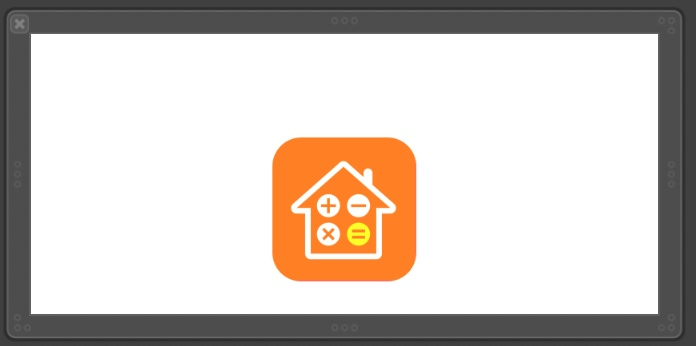

# ZYAdKit

[](https://travis-ci.org/Yu Yang/ZYAdKit)
[](https://cocoapods.org/pods/ZYAdKit)
[](https://cocoapods.org/pods/ZYAdKit)
[](https://cocoapods.org/pods/ZYAdKit)


##1.设置config



- 1. 先设置config, 把要显示的`rootViewController`传过去
- 2. 加载假的`launchView`, 和真的`launchView`一摸一样的	`view`, 如上图
- 3. 获取占位的VC显示
- 4. 未获取到, 则加载自己的`rootViewController`

```
let config = AdConfig()
let storyboard = UIStoryboard(name: "Main", bundle: nil)
let mainVc = storyboard.instantiateInitialViewController()!
config.rootViewController = mainVc
AdManager.shared.setConfig(config)


let placeholderLaunchView = Bundle.main.loadNibNamed("PlaceholderLaunchView", owner: nil, options: nil)?.first as! UIView
        
if let placeholderLaunchVc = AdManager.shared.getPlaceholderViewController(with: placeholderLaunchView) {
	window = UIWindow(frame: UIScreen.main.bounds)
	window?.rootViewController = placeholderLaunchVc
} else {
	window = UIWindow(frame: UIScreen.main.bounds)
	window?.rootViewController = mainVc
}
window?.makeKeyAndVisible()

```

##2.获取到配置保存到本地. 然后缓存数据

```
UserDefaults.standard.setValue(json, forKey: "kAdInfo")
UserDefaults.standard.synchronize()

AdManager.shared.cacheDatas()
```